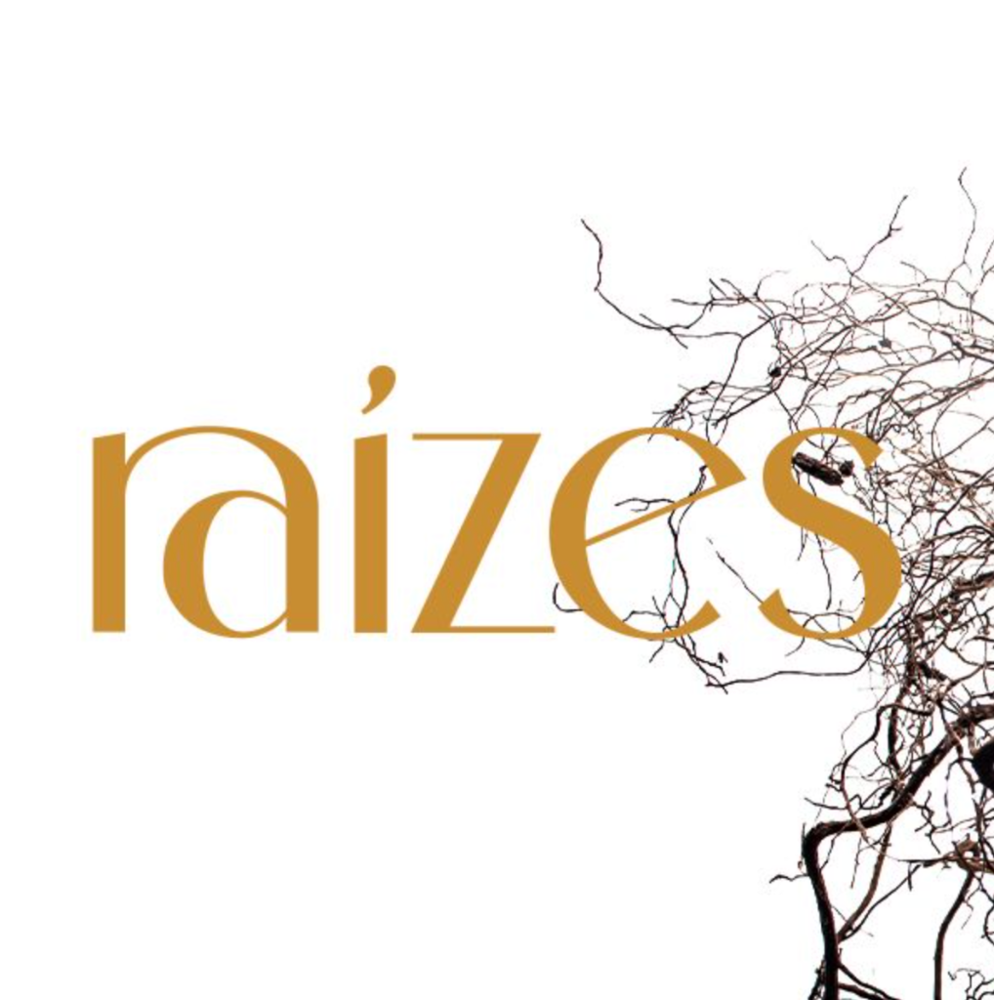

#  Raio-X Completo: Grupo Raízes (Junho/26)

> 📅 **Última atualização:** 18/06/2026 às 19:37

## 🌿 Apresentação do Programa Raízes

O **Raízes** é um programa de aceleração e implementação de negócios digitais. O foco principal é apoiar você a criar seu primeiro produto e aprender as melhores estratégias de vendas para quem quer começar no digital. Escolhemos esse formato para garantir que você terá resultados. Simples assim.

São **dois os pilares principais** que trabalhamos no programa:

* 🧭 **Pilar Método:** Durante os últimos dois anos nós testamos e validamos (conosco e com nossos mentorados, em diversos nichos) as melhores estratégias para vender cursos e mentorias de uma maneira leve, sem depender de lançamentos. Tudo isso foi organizado em uma metodologia passo a passo, de rápida execução, para você colocar seus infoprodutos no ar (de cursos baratos até ofertas *High Ticket*) em tempo recorde e com resultados impressionantes.
* ⚡ **Pilar Execução:** 100% do conteúdo do Programa será prático. Não terá espaço para teorias e conceitualizações. Nós respeitamos seu tempo e energia, e sabemos que você precisa de resultados rápidos. Você terá acesso às nossas ferramentas exclusivas, templates de posts e páginas, automações prontas, além do nosso acompanhamento diário mágico.

---
## 📜 Diretrizes de Convivência & Atalhos do Grupo

Para manter o foco nas estratégias de negócios digitais e preservar a boa convivência do grupo, a moderação estabeleceu as seguintes diretrizes na descrição do WhatsApp:

### 🤝 Aqui você pode:
* ✅ Compartilhar suas conquistas, aprendizados, memes e conhecer melhor seus colegas.
* ✅ Pedir ajuda e opiniões de outros alunos sobre seu conteúdo. **Regra importante:** deixe explícita sua intenção para os colegas saberem como ajudar você, e **nunca utilize o espaço para divulgações frias**.

### ⚠️ Regras de Convivência (Cuidado):
* ❌ **É proibido** o compartilhamento de links de grupos paralelos, materiais de imersões ao vivo e/ou com direitos autorais e divulgações externas que fogem do foco da metodologia do Raízes (como pedido de ajuda para vaquinhas, propagandas políticas, etc).
* 💬 Dúvidas sobre conteúdo e estratégia devem ser feitas através dos comentários da plataforma oficial ou retiradas diretamente nas tutorias dos plantões de dúvidas.
* 🕊️ Mantenha o espaço da boa convivência: não falamos sobre política, religião, futebol ou outros tópicos que possam gerar conflitos.
* 💙 Seja gentil. Se tiver qualquer incômodo que não queira expressar no grupo, acione o suporte de alunos da Maré no número indicado de suporte.

### 🔗 Atalhos Úteis:
* 🤖 **Atalho da Raíza (IA):** [ia-raizes.mareeducacao.com.br](https://ia-raizes.mareeducacao.com.br/) *(use seu e-mail de cadastro do Raízes)*
* 🎓 **Área de Alunos (Hotmart):** [Acesso pro Raízes](https://hotmart.com/pt-br/club/mareeducacao/products/3758918)
* 📞 **Suporte do Raízes:** [WhatsApp (11) 5199-8656](https://wa.me/551151998656)
* 🚀 **PEI!**

---
## 📅 Agenda Exclusiva da Turma (Junho/26)

| Encontro / Evento | Data e Horário | Foco do Encontro |
| :--- | :---: | :--- |
| 🤩 **Boas-vindas** | **22/06** (14h - 16h) | Integração oficial e anúncio dos bônus do primeiro dia |
| 🔧 **Plantão Técnico (Van)** | **23/06** (09h - 11h) | Orientação sobre ferramentas e plataforma |
| 🤓 **Tutoria com Lore I** | **25/06** (19h30 - 21h30) | Plantão de dúvidas exclusivo de início |
| 🔨 **Imersão Bate Martelo (Lore)** | **30/06** (09h - 12h) | Definição e alinhamento do Nicho de Negócios |
| 🤓 **Tutoria com Lore II** | **02/07** (19h30 - 21h30) | Plantão de dúvidas final exclusivo da turma |
| 🎯 **Desafio Flecha (Sara)** | **06/07 a 10/07** (08h - 09h) | Aceleração diária de posicionamento |
| ✍️ **Desafio de Conteúdo (Lore)** | **13/07 a 17/07** (08h - 09h) | Produção prática de narrativas digitais |
| 🔍 **Sessão de Análise (Carol)** | **20/07** (14h - 17h) | Análise aprofundada de entregáveis de alunos |
| 🧘 **Rotina e Produtividade (Myca)** | **04/08** (10h - 12h) | Estruturação de hábitos e alta performance |
| 💬 **Plantões Semanais** | **Todas as quartas** (noite) | Acompanhamento de dúvidas gerais ao vivo |

> *Obs: Todos os encontros ao vivo são gravados e sobem na Hotmart em até 24h. A participação é recomendada, mas opcional (siga sua fase).*

---
## 🌟 Cases de Sucesso & Depoimentos (Turma Junho/26)

### 🎭 A "Estreia" no Palco das Vendas — Arthur Martins (Ator, Palhaço & Terapeuta)
> **"Caramba!!! Hoje fiz minha primeira call de venda e fechei minha primeira mentorada!!! Estou em êxtase aqui!!! Destravou!!!"**
>
> "Sei que posso ter pulado algumas etapas, mas a urgência financeira falou alto. Segui a intuição. Peguei todas as informações assimiladas no Desafio e fui para o 'palco'.
>
> Fiz a call com uma conhecida, minha aluna de meditação. Não é a persona high ticket para a minha mentoria, porém quis fazer com ela para 'ensaiar', destravar meu medo e validar o método.
>
> Segui todo o roteiro do Flecha, com muita escuta ativa, falando sobre o que era do interesse da cliente. Travei um pouco ao apresentar a mentoria, pois quis ler direitinho o que estava escrito, mas fluiu. Quando terminei a apresentação, a cliente falou:
> *— Nossa, você leu meu diagnóstico?* 🤣🤣🤣
>
> A conversa seguiu mais um pouco, e eu ali, tranquilamente ansioso, esperando ela perguntar o preço. Quando finalmente a pergunta veio, eu, com toda a cara lisa do mundo, falei o preço cheio.
>
> Ela travou. Entrou em pânico e começou a se justificar, para dizer que estava fora das possibilidades dela. Eu sabia que era caro para ela mesmo, mas quis dizer o preço cheio para sentir a reação. E perceber como me sentiria ao falar um preço tão distante do que estou acostumado a cobrar.
>
> Como palhaço, sempre tenho cartas na manga. Já tinha calculado três propostas de preço para ver em qual faixa ela se sentiria mais confortável para investir, sem morrer de susto. Fui apresentando uma por uma, até chegar ao valor que foi alegre para ambos. E assim consegui fechar minha primeira venda, na primeira call, por 20% do valor cheio. Vai ser ótimo para treinar, validar o método e ganhar confiança.
>
> Ao final, ainda fiz um exercício de yoga do riso com ela para sairmos leves da reunião.
>
> Percebi, senti que este formato de trabalho com mentoria é onde todos os meus 'eus' — ator, palhaço, poeta, terapeuta Xamânico/holístico, massoterapia, líder de Yoga do riso, condutor de meditação, pai de menina e observador do viver — encontraram assento.
>
> Uau! Funciona! É real! Gratidão, Raízes! Xeros ❤️"

---
## 📊 1. Resumo por Estado de Origem

| Estado | Quantidade | Porcentagem |
| :--- | :---: | :---: |
| Não Identificado | 109 | 54.8% |
| São Paulo | 31 | 15.6% |
| Rio de Janeiro | 14 | 7.0% |
| Paraná | 9 | 4.5% |
| Santa Catarina | 7 | 3.5% |
| Minas Gerais | 6 | 3.0% |
| Rio Grande do Sul | 5 | 2.5% |
| Ceará | 4 | 2.0% |
| Bahia | 4 | 2.0% |
| Rio Grande do Norte | 2 | 1.0% |
| Distrito Federal | 2 | 1.0% |
| Espírito Santo | 1 | 0.5% |
| Mato Grosso | 1 | 0.5% |
| Sergipe | 1 | 0.5% |
| Alagoas | 1 | 0.5% |
| Pernambuco | 1 | 0.5% |
| Amazonas | 1 | 0.5% |
| **Total Geral** | **199** | **100.0%** |

## 🎯 2. Resumo por Nicho/Habilidade Pretendida

| Nicho / Habilidade | Quantidade | Porcentagem |
| :--- | :---: | :---: |
| Não se apresentou / Silencioso | 96 | 48.2% |
| Saúde Integrativa, Corpo & Movimento | 27 | 13.6% |
| Gestão Feminina, Transição de Carreira & Maturidade | 19 | 9.5% |
| Liderança / Organização Corporativa | 18 | 9.0% |
| Vendas B2B & Consultoria PME | 8 | 4.0% |
| Cuidado Parental & Família | 8 | 4.0% |
| Educação & Mentoria Acadêmica | 7 | 3.5% |
| Música, Teatro, Arte & Palhaçaria | 6 | 3.0% |
| Inovação Técnica de Base & Sustentabilidade | 5 | 2.5% |
| Outros / Em estruturação | 5 | 2.5% |
| **Total Geral** | **199** | **100.0%** |

## 💤 3. Quadro de Membros Silenciosos

* **Membros que se apresentaram (Ativos):** 102 (51.3%)
* **Membros que não se manifestaram (Silenciosos):** 97 (48.7%)

---
## 🧭 3. Agrupamentos por Semelhança de Propósito (Membros Ativos)

A tribo ativa é dividida nos seguintes eixos principais de atuação:
1. **Gestão Feminina, Transição de Carreira & Maturidade (30+, 40+, 50+):** Foco em tirar mulheres do piloto automático ou do esgotamento corporativo, redesenhando a vida pessoal e profissional.
2. **Cuidado Parental & Família (TEA, TDAH, Típicas):** Apoio a pais e educadores lidando com neurodivergências infantis ou orientação de rotinas educativas.
3. **Neurodivergências Práticas na Vida Adulta (Dupla Excepcionalidade - 2E/TDAH):** Mentoria cognitiva e de rotinas adaptadas para adultos.
4. **Saúde Integrativa, Corpo & Movimento (Yoga, Ayurveda, Terapias):** Terapias holísticas, clínica moderna e yoga para equilíbrio físico e de carreira.
5. **Inovação Técnica de Base & Sustentabilidade (Construção, Ecologia, Agro):** Modelos ecológicos, engenharia florestal e bioeconomia circular.
6. **Vendas B2B & Consultoria PME:** Processos comerciais, consultoria financeira e vendas de alta performance no digital.
7. **Educação & Mentoria Acadêmica:** Apoio a processos seletivos de mestrado/doutorado, destrave de escrita científica/criativa, formação continuada de professores e ensino de idiomas.

---
## ⚡ 4. Sinergias e Conexões Estratégicas Internas

Conexões e convergências voltadas estritamente para estruturação de parcerias e produtos digitais no grupo:
1. **Fabio Takwara 🤝 Marcello Pedro (Ecologia & Surf):** Marcello Pedro (professor de surf no RJ) e Fabio Takwara (bambu termorretificado + PU vegetal para projetar pranchas de surf ecológicas).
2. **A Rede de Pedagogia & Apoio Parental (Mandy Bettega 🤝 Bruna Arciere 🤝 Luciana 🤝 Monica Marques 🤝 Aline Koller 🤝 Tatiana Fávaro Lima):** Integração de psicólogas, pedagogas Waldorf e especialistas em ABA para fornecer materiais consolidados e suporte educacional familiar.
3. **Parcerias de Tecnologia, Dados & Processos (Fabio Takwara 🤝 Rodrigo Dumont 🤝 Shayenne Moura 🤝 Davi Brasil 🤝 Anderson Gonzaga 🤝 Gabriel Martens):** Sinergia entre líderes de dados, cientistas de dados e gestores de processos de TI para estruturar automações e sistemas eficientes no meio corporativo e ambiental.
4. **Sinergia Ayurveda, Yoga & Terapias (Carina Vieirat 🤝 Dëbora Nascı̊uti 🤝 Ju Zanella 🤝 Ju Almeida 🤝 Jordana Mol):** Colaboração entre professoras de Yoga, terapeutas Ayurveda e ginecologistas integrativas para estruturação de mentorias corporativas e programas de bem-estar focados na saúde da mulher.
5. **Rede de Liderança Feminina & Desenvolvimento (Si Briganti 🤝 Bela Giannini 🤝 Michelle Santiago 🤝 Marcia Andrade 🤝 Psi Nara Barreto 🤝 Evelen Tomaz 🤎):** Cruzamento de competências de consultoras de negócios, executivas de RH, especialistas em experiência do paciente e psicólogas para criar mentorias de liderança corporativa feminina, humanização em saúde, experiência do paciente e superação de burnout.
6. **Sinergia Cenografia Ecológica & Estruturas Cênicas (Fabio Takwara 🤝 Hernani Albuquerque 🤝 Theo Oliveira 🤝 Arthur Martins 🤝 Alex Reis 🤝 Angelica Martins):** Conexão entre a especialidade de Fabio Takwara em cúpulas geodésicas de bambu e estruturas circenses com Hernani (Naniko's Circus), Theo e Arthur (artistas cênicos/teatro), Alex (músico) e Angelica (design visual da cena). Abre oportunidades para palcos itinerantes sustentáveis, picadeiros ecológicos e instalações cênicas modulares para espetáculos ao ar livre.
7. **Rede de Educação, Escrita & Mentoria Acadêmica (Ana Carolina Mattoso 🤝 Eron Villar 🤝 Alex Maciel 🤝 Fabrícia Coelho 🤝 Milena 🤝 Joey Jacksonn 🤝 Patrícia Bertachini Bissetti):** Conexão entre mentoras acadêmicas, psicopedagogas, professores e especialistas em escrita/pedagogia para a estruturação de programas de capacitação continuada, destrave de escrita acadêmica/concursos, preparação para seleções de pós-graduação e ensino de idiomas.

---
## 📋 5. Lista Geral Detalhada (Todos os Membros Mapeados)

> [!NOTE]
> **Censo e Nota de Metodologia:**
> O censo oficial do WhatsApp conta com **194 membros** no grupo. A equipe de moderação e suporte é composta por **6 integrantes**:
> * 👑 **Marcus** (Co-fundador / Mentor do Raízes)
> * 👑 **Myca** (Co-fundadora / Mentora do Raízes)
> * 👥 **Vanessa Fleig** (Suporte ao Aluno / Sucesso do Aluno)
> * 🛠️ **Suporte** (Atendimento Técnico / Suporte ao Aluno)
> * 📢 **Maré Educação** e **Raízes** (Contas Institucionais / Moderadores)
> 

> Descontados os administradores, o grupo conta com **188 participantes**. A listagem detalhada registra **199** registros devido a uma sobreposição técnica temporária (membros silenciosos que entraram mostrando apenas o número de telefone e depois interagiram usando seus nomes, ou que utilizaram duas contas distintas no processo).

| Nome / Identificador | Localização | Profissão Original | Instagram / Contato | Foco Principal / Status | Neurodivergência |
| :--- | :--- | :--- | :--- | :--- | :--- |
| **ALEX REIS** | RJ | Músico / Baterista | [alexreisrodriguez](https://www.instagram.com/alexreisrodriguez) | Método Bateria Essencial (Cirque du Soleil) | - |
| **Adriana Barbetta** | PR (Londrina) | Empresária | [adrianabarbetta](https://www.instagram.com/adrianabarbetta) | Desenvolvimento pessoal e financeiro para mulheres | - |
| **Adriana Gaia** | Não Identificado | Mercado Ótico / Empresária | [oticaadrianagaia](https://www.instagram.com/oticaadrianagaia) | Mentoria Empreender sem Franquia no ramo ótico em 90 dias | - |
| **Alex Maciel** | Não Identificado | Trainer Educacional | [alexmacielprofessor](https://www.instagram.com/alexmacielprofessor) | Apoio e mentoria de estudos para aprovação escolar/concursos | - |
| **Aline Koller** | - | Psicóloga Junguiana | [alinekollerpsi](https://www.instagram.com/alinekollerpsi) | Maternidade de filhos neurodivergentes | TDAH |
| **Alivinio Econoeduca** | - | Economista / Prof. | [alivinioalmeida](https://www.instagram.com/alivinioalmeida) | Análise e Processos de Gestão para PMEs | - |
| **Amanda Cardoso** | SE (Aracaju) | Fotógrafa | [amandacardosofotografia](https://www.instagram.com/amandacardosofotografia) | Fotografia de partos e famílias | - |
| **Ana Carolina Mattoso** | - | Prof. / Mentora Acadêmica | [professora.mattoso](https://www.instagram.com/professora.mattoso) | Mentoria acadêmica para processos seletivos e escrita | - |
| **Ana Simões** | - | Psicóloga Intensivista | [souanasimoes](https://www.instagram.com/souanasimoes) | Humanização e autoconhecimento hospitalar | - |
| **Anderson Gonzaga** | Não Identificado | Prof. / Mentor / Facilitador (Tech & Gestão) | [eu.sou.gonzaga](https://www.instagram.com/eu.sou.gonzaga) | Transformação organizacional, Business Agility e liderança | - |
| **Andréa Claudini ⚡** | PR (Londrina) | Hipnoterapeuta / Metacampo | [Link](https://www.instagram.com/reel/DZAn_BNReU3/?igsh=MTJ4aGNtZmdnMHE3ZA==) | Novo significado para a segunda metade da vida | - |
| **Angel** | - | Designer Visual da Cena | [angelicamartpe](https://www.instagram.com/angelicamartpe) | Design do Espetáculo cênico | - |
| **Angela** | - | Massoterap. Tântrica | - | Cura de traumas e independência emocional | - |
| **Arlete D'arc  Mentora e Psicanalista Cristã de Mulheres** | SP (Poá) | Psicanalista Cristã | [arletedarc_mentorapsicanalista](https://www.instagram.com/arletedarc_mentorapsicanalista) | Recomeço de mulheres após relações abusivas | - |
| **Arthur Martins** | AL (Maceió) | Ator / Palhaço | - | Mentoria Exale (pausa criativa e palhaçaria) | - |
| **Bela Giannini** | MG (Ouro Preto) | Recursos Humanos | - | Transição de carreira de RH | - |
| **Carina Vieirat** | RJ | Terapeuta Ayurveda / Prof. de Yoga | [carinavieirat](https://www.instagram.com/carinavieirat) | Mentoria de saúde e bem-estar para mulheres em fase de mudança | - |
| **Carla Gonçalves** | RJ (Volta Redonda) | Adm / Coach de Bem-Estar | [carlametodorc](https://www.instagram.com/carlametodorc) | Método RC de emagrecimento para famílias | - |
| **Carolina Bernardo** | DF (Brasília) | Bióloga/Dra. Economia | [carolinidades](https://www.instagram.com/carolinidades) | Leis e políticas ambientais p/ analistas | - |
| **Cínthya Alcântara** | SC | Psicóloga | [cinthya.alcantarapsi](https://www.instagram.com/cinthya.alcantarapsi) | Segurança interna para mulheres competentes | - |
| **Daniela Carneiro** | PR (Curitiba) | Adm / Franquias | [dfcconsultoria](https://www.instagram.com/dfcconsultoria) | Gestão de KPIs para cafeterias/padarias | - |
| **Daniela Freitas** | - | Fisioterapeuta | [danielasoufreitas](https://www.instagram.com/danielasoufreitas) | Mentoria para empreendedoras da saúde | - |
| **Daniela Teixeira** | SP | Enfermeira | [LinkedIn](https://www.linkedin.com/in/daniela-teixeira) | Gestores para Medicina Diagnóstica | - |
| **Davi Brasil** | - | Gestor Tech (ex-ITA) | [LinkedIn](https://www.linkedin.com/in/davibrasil) | Adultos 2E (TDAH + Altas Habilidades) | TDAH / AH/SD (2E) |
| **Diego Americo** | SP | Cabeleireiro / Beauty | [diegoamerico](https://www.instagram.com/diegoamerico) | Artista da Beleza (Direção de Carreira) | - |
| **Diulio Gomes✝️⚓** | RS | Ator / Teólogo | [diulio_gomes](https://www.instagram.com/diulio_gomes) | Comunicação e oratória para especialistas | - |
| **Dra Alessandra Menegario** | SP (Promissão) | Fisioterapeuta | [anastore_as](https://www.instagram.com/anastore_as) | Saúde integrativa, mente e corpo | - |
| **Dra. Ana Brisolla** | SP (Interior) | Advogada / Amante da Arte | - | Nicho de mentoria em estruturação | - |
| **Dëbora Nascı̊uti** | - | Prof. Yoga/Meditação | [deboranasciuti](https://www.instagram.com/deboranasciuti) | Método Florescer (Ansiedade/Burnout/PNL) | - |
| **Eron Villar** | PE (Recife) | Doutorando UFPE | [destravando_a_escrita21](https://www.instagram.com/destravando_a_escrita21) | Redação em concursos (Jornada do Herói) | - |
| **Evelen Tomaz 🤎** | BA (Salvador) | Experiência do Paciente | - | Humanização e experiência do paciente em saúde | - |
| **Fabiana Fortunato** | MG (Santa Luzia) | Psicóloga | - | Transição de carreira para mulheres | - |
| **Fabiane Ji | Yoga & Ayurveda** | BA | Instrutora de Yoga | [fabiane_ji](https://www.instagram.com/fabiane_ji) | Sustentabilidade de carreira para viver de Yoga | - |
| **Fabio Takwara** | SP (Limeira) | Ambientalista / Autodidata | [fabiotakwara](https://www.instagram.com/fabiotakwara) | Bambu termorretificado + PU de Mamona, construção de estruturas leves (cúpulas geodésicas) & workflows de IA. Assista: [Estrutura Leve (Shorts)](https://www.youtube.com/shorts/cR3EY8laLAw) & [Domo de Bambu (Vídeo)](https://youtu.be/OGeVIEGZfb0?si=fB3dTQQi7PW7TnsV) | TDAH |
| **Fabrícia Coelho** | - | Prof. Alfabetizadora | - | Método OnomoFônico p/ professores alfabetizadores | - |
| **Fernanda Moraes** | RS | Nutricionista | [fernandamoraes_nutri](https://www.instagram.com/fernandamoraes_nutri) | Mitigação de sintomas da menopausa 40+ | - |
| **Gabriel Martens** | RJ | Gestor de Processos de TI | [martensglobal](https://www.instagram.com/martensglobal) | Mentoria de gestão de processos de TI e tecnologia para empresas em crescimento | - |
| **Giovanna Sequeira** | - | Atriz / Mentora | [gisequeira](https://www.instagram.com/gisequeira) | Comunicação e escrita de livros | - |
| **Grupo Tech Lucas Vargas** | RS | Consultor Condominial | [lucasvargas.consultor](https://www.instagram.com/lucasvargas.consultor) | Vendas B2B para o setor condominial | - |
| **Hernani Albuquerque** | Não Identificado | Educador Físico / CEO Naniko's Circus / Dentista | [hernanialbuquerque](https://www.instagram.com/hernanialbuquerque) | Mentoria de carreira e negócios para profissionais circenses | - |
| **Ilana Lewinsohn** | BA (Arraial d'Ajuda) | Bióloga / Terapeuta | [massixa](https://www.instagram.com/massixa) | Massagem Integrativa Xamânica | - |
| **Joey Jacksonn** | PR (Curitiba) | Prof. de Musicalização / Coordenador | [joeyjacksonn_](https://www.instagram.com/joeyjacksonn_) | Método PRO Action: aprender idiomas com propósito, autonomia e constância (método geral aplicável a qualquer idioma, e muito eficaz também para TDAH/neurodivergentes) | TDAH / AH/SD |
| **Jordana Mol** | MG (BH) | Ginecologista | [drajordanamol](https://www.instagram.com/drajordanamol) | Saúde integral no climatério | - |
| **Joslaene Santos** | SC | Nutricionista | [joslaene.simao](https://www.instagram.com/joslaene.simao) | Diabetes e capacitação de nutricionistas | - |
| **Joyce Costa** | - | Arquiteta/Cientista Soc. | [eu.joycecosta](https://www.instagram.com/eu.joycecosta) | Mulheres 40+ de alta performance neurodivergentes | Neurodivergente |
| **Joyce Muzy** | SP | Psicóloga TCC | - | Mentoria para mulheres sobrecarregadas | - |
| **Ju Almeida** | SP | CMO / Mkt / Eventos | [LinkedIn](https://www.linkedin.com/in/jualmeidaa) | Valor estratégico para líderes e executivos | - |
| **Ju Zanella Nutri | Ayurv.** | - | Nutri. Ayurveda | [juzanella.ayurveda](https://www.instagram.com/juzanella.ayurveda) | Longevidade saudável e cuidados paliativos | - |
| **Karime Neder** | RJ (Ilha Grande) | Prof. Yoga | - | Formação de professores de Vinyasa Yoga | - |
| **Karla Barreiros** | RJ (Araruama) | Advogada / Ceramista | - | Transição de carreira e análise consciencial | - |
| **Karla Santos** | - | Psicóloga / RH | [karlasantoscarreira](https://www.instagram.com/karlasantoscarreira) | Planejamento e posicionamento de carreira | - |
| **Kaua (ka.consciente)** | RJ | Tatuador | [ka.consciente](https://www.instagram.com/ka.consciente) | Projeto Caverna (reconstrução de identidade) | - |
| **LM** | SP | CMO / Mkt / Eventos | [LinkedIn](https://www.linkedin.com/in/jualmeidaa) | Valor estratégico para líderes e executivos | - |
| **Lari Gaigher** | SP (Guararema) | Prof. Yoga | [larissagaigher](https://www.instagram.com/larissagaigher) | Espiritualidade viva além do tapetinho | - |
| **Lucas Rodrigues** | - | Consultor de Mkt | - | Branding e posicionamento de empresas premium | - |
| **Lucas Roel** | Não Identificado | Agronegócio (Bioinsumos & Fisiologia) | ROELX | Advisory, mentorias e performance de vendas no Agronegócio | - |
| **Luciana** | SC (Floripa) | Pedagoga / Psicopedagoga | - | Mentoria InPulsa: a saída é para dentro para mulheres 35+ | - |
| **Luciana Mota** | SC (Floripa) | Pedagoga / Psicopedagoga | - | Mentoria InPulsa: a saída é para dentro para mulheres 35+ | - |
| **Luiza Doula e Consultora Materna** | - | Doula / Consultora | [luiza_doula](https://www.instagram.com/luiza_doula) | Puerpério e amamentação sem caos | - |
| **Luiza Lyra** | BA (Vitória da Conquista) | Ortodontista | [luizanayara](https://www.instagram.com/luizanayara) | Dentistas saindo da zona de conforto | - |
| **MaCecilia Beltran Vargas** | - | Ortodontista/Psicoemb. | [dra.maceciliabeltran](https://www.instagram.com/dra.maceciliabeltran) | Gestão conectada e maternidade consciente | - |
| **Mandy Bettega 🪷** | SC | Pedagoga / Esp. ABA | - | Mentoria para pais e responsáveis de crianças com TEA | - |
| **Marcello Pedro** | RJ | Prof. Ed. Física / Surf | [bodyboardlgendsclub](https://www.instagram.com/bodyboardlgendsclub) | Performance no surf e PCDs (Lei do Mar) | TDAH |
| **Marcia Andrade** | SP | Terapeuta Transpessoal / ex-Oficial PM SP | [marcitaregina_terapeuta](https://www.instagram.com/marcitaregina_terapeuta) | Mentoria de descompressão emocional para mulheres sobrecarregadas | - |
| **Marcia Penna de Castro** | - | Psicanalista | [marciacastropsi](https://www.instagram.com/marciacastropsi) | Desenvolvimento emocional | - |
| **Marisa** | SP (Capital/Lapa) | Mercado Financeiro / Terapeuta | [ma.rmalvs](https://www.instagram.com/ma.rmalvs) | Mentoria Recalibrar a Rota (autoestima, clareza e equilíbrio) | - |
| **Maíra Salomão** | SP | Psicóloga | - | Transição de vida para mulheres 30+ | - |
| **Micheline** | - | Terapeuta Holística | [cuidardedentro.oficial](https://www.instagram.com/cuidardedentro.oficial) | Alívio de Ansiedade | - |
| **Michelle Santiago** | SP (Águas de S. Pedro) | Enfermeira | - | Liderança Sistêmica para equipes de saúde | - |
| **Milena** | RS (Getúlio Vargas) | Professora / Mentora | - | Capacitação e formação continuada para professores | - |
| **Monica Marques** | RJ | Fonoaudióloga | [p/DXj7AvLgARv](https://www.instagram.com/p/DXj7AvLgARv) | Pais de neurodivergentes (Autismo/TDAH) | - |
| **Mychael Marcel** | - | SEO / Ads | [mychaelmarcel](https://www.instagram.com/mychaelmarcel) | Posicionamento local no Google e IAs | - |
| **Nandà Luccâs** | SP (USP) | Bióloga USP | - | Honey Trace Brasil (rastreabilidade de mel) | TDAH / AH/SD |
| **Nathália Pantaleão** | DF | Nutricionista | - | Rotina functional para empreendedoras | - |
| **Ohanna Pacheco** | SC (Araranguá) | Manejo Comportamental de Animais | [evolu_pet](https://www.instagram.com/evolu_pet) | Mentoria online de comportamento animal e pets não-convencionais | TDAH / Bipolar Tipo 2 |
| **Patrícia Bertachini Bissetti** | Não Identificado | Psicopedagoga | [pbertachini](https://www.instagram.com/pbertachini) | Psicopedagogia Clínica e Institucional. Site: [psicopedagogiainovadora.com.br](http://www.psicopedagogiainovadora.com.br) | - |
| **Prem Karima** | RJ (Búzios) | Produtora de Eventos | [relucilara](https://www.instagram.com/relucilara) | Método Evento Vivo (sustentabilidade) | - |
| **Priscila Kalil Psi** | - | Psicóloga / RH | [priscilakalil.psi](https://www.instagram.com/priscilakalil.psi) | Projeto Lidere-se (Autogestão de Vida) | - |
| **Psi Nara Barreto** | RJ | Psicóloga TCC | [narabarretopsicologa](https://www.instagram.com/narabarretopsicologa) | Mentoria Desperte seu valor (autoestima e independência emocional pós-abuso) | - |
| **Raquel Peres** | Não Identificado | Psicóloga Infanto-Juvenil / Esp. ABA | - | Mentoria para profissionais de saúde e educação sobre raciocínio clínico criativo em ABA | - |
| **Renata Cardinali | Direcionadora Familiar** | - | Direcionadora Familiar | [renata.cardinali](https://www.instagram.com/renata.cardinali) | Orientação familiar e parentalidade | - |
| **Ricardo Arruda** | CE (Fortaleza) | TikToker / Mentor | [ricardoarrudamentor](https://www.instagram.com/ricardoarrudamentor) | Sair do zero no TikTok Shopping | - |
| **Rodrigo Dumont** | - | Líder de Dados / Tech | [dumontrodrigo](https://www.instagram.com/dumontrodrigo) | Liderança em Dados no meio corporativo | - |
| **Rogê Biuzo** | RJ (Saquarema) | Palestrante / Mágico | [rogebiuzo](https://www.instagram.com/rogebiuzo) | Além do Contracheque (renda extra p/ pais e profs.) | - |
| **Sandra** | SP (Promissão) | Fisioterapeuta | [anastore_as](https://www.instagram.com/anastore_as) | Saúde integrativa, mente e corpo | - |
| **Sandra Azzari** | SP (Promissão) | Fisioterapeuta | [anastore_as](https://www.instagram.com/anastore_as) | Saúde integrativa, mente e corpo | - |
| **Shayenne Moura** | - | Data Scientist | - | Equilíbrio de rotina para líderes de TI | AH/SD |
| **Sheila Voos** | - | Educadora | [sheilavoos](https://www.instagram.com/sheilavoos) | Soft skills e Neurociência aplicada | - |
| **Si Briganti** | SP (Embu das Artes) | Pesquisadora de Mercado / ex-Executiva | [sousibriganti](https://www.instagram.com/sousibriganti) | Mentoria Lead2Be (liderança feminina para novas gestoras) | - |
| **Simone Inês** | RJ | Pedagoga | [simoneinesescritora](https://www.instagram.com/simoneinesescritora) | Maternidade espiritual e seres de luz | - |
| **Su 😁✨️** | Não Identificado | Biomédica / Servidora Pública / Terapeuta | - | Ressignificação de crenças e liberação de padrões repetitivos para terapeutas | - |
| **Tais Jardim** | CE (Fortaleza) | Artesã | [teaatelie](https://www.instagram.com/teaatelie) | Macramê em grandes obras e decoração | - |
| **Tatiana Fávaro Lima** | PR (Curitiba) | Pedagoga Waldorf / ex-TI Prof. | - | Orientação familiar para gestantes ou famílias com crianças de 0 a 3 anos | - |
| **Taynara Mattos - Massoterapia clínica e Acupuntura.** | - | Fisioterapeuta | [taynaramattosfisio](https://www.instagram.com/taynaramattosfisio) | Massoterapia Clínica e Acupuntura | - |
| **Telma Psicoterapeuta Integrativa** | RN (Parnamirim) | Enfermeira | - | Psicoterapia Integrativa | - |
| **Thays Toyofuku** | - | Consultora DE&I | [thaystoyofuku](https://www.instagram.com/thaystoyofuku) | Comunicação inclusiva e DEI corporativo | - |
| **Theo Oliveira (ele/elu) 🏳️‍⚧️** | SP (Capital/Lapa) | Ator / Palhaço | [circodisoladies](https://www.instagram.com/circodisoladies) | Palhaçaria cênica e neurodivergência | - |
| **Tiago Campetti** | PR (Curitiba) | Arquiteto | [arquiteto_tiagocampetti](https://www.instagram.com/arquiteto_tiagocampetti) | Capacitação para planejamento e execução de reformas residenciais | - |
| **Viviane** | - | Hipnoterapeuta | [vivi_terapia_viva](https://www.instagram.com/vivi_terapia_viva) | Hipnose clínica baseada em neurociência | - |
| **Vladia Lima** | CE (Fortaleza) | Neuropsicóloga | [vladialimapsicologa](https://www.instagram.com/vladialimapsicologa) | Mentoria prática de TDAH para adultos | - |
| **Ynglety Barros** | AM | Etiqueta e Comport. | [yngletybarros](https://www.instagram.com/yngletybarros) | Forte & Elegante (Presença e Etiqueta) | - |
| **⚡Vânia Távora** | CE (Fortaleza) | - | - | Posicionamento digital no digital | - |
| **+55 11 91156‑9754** | São Paulo | - | - | Não se apresentou / Silencioso | - |
| **+55 11 93224‑2439** | São Paulo | - | - | Não se apresentou / Silencioso | - |
| **+55 11 94116‑0491** | São Paulo | - | - | Não se apresentou / Silencioso | - |
| **+55 11 97205‑3690** | São Paulo | - | - | Não se apresentou / Silencioso | - |
| **+55 11 98444‑9310** | São Paulo | - | - | Não se apresentou / Silencioso | - |
| **+55 11 99500‑6830** | São Paulo | - | - | Não se apresentou / Silencioso | - |
| **+55 11 99712‑0563** | São Paulo | - | - | Não se apresentou / Silencioso | - |
| **+55 11 99894‑0115** | São Paulo | - | - | Não se apresentou / Silencioso | - |
| **+55 11 99969‑6741** | São Paulo | - | - | Não se apresentou / Silencioso | - |
| **+55 19 99449‑0101** | São Paulo | - | - | Não se apresentou / Silencioso | - |
| **+55 19 99672‑8511** | São Paulo | - | - | Não se apresentou / Silencioso | - |
| **+55 21 99690‑3499** | Rio de Janeiro | - | - | Não se apresentou / Silencioso | - |
| **+55 22 97405‑1265** | Rio de Janeiro | - | - | Não se apresentou / Silencioso | - |
| **+55 27 99648‑9439** | Espírito Santo | - | - | Não se apresentou / Silencioso | - |
| **+55 31 98869‑1001** | Minas Gerais | - | - | Não se apresentou / Silencioso | - |
| **+55 41 99190‑7000** | Paraná | - | - | Não se apresentou / Silencioso | - |
| **+55 41 99259‑3540** | Paraná | - | - | Não se apresentou / Silencioso | - |
| **+55 41 99509‑6720** | Paraná | - | - | Não se apresentou / Silencioso | - |
| **+55 45 99989‑8900** | Paraná | - | - | Não se apresentou / Silencioso | - |
| **+55 47 99206‑0402** | Santa Catarina | - | - | Não se apresentou / Silencioso | - |
| **+55 51 99114‑1161** | Rio Grande do Sul | - | - | Não se apresentou / Silencioso | - |
| **+55 65 99698‑0327** | Mato Grosso | - | - | Não se apresentou / Silencioso | - |
| **+55 83 99992‑3058** | Não Identificado | - | - | Não se apresentou / Silencioso | - |
| **+55 84 99227‑5115** | Rio Grande do Norte | - | - | Não se apresentou / Silencioso | - |
| **+55 84 99403‑5893** | Rio Grande do Norte | - | - | Não se apresentou / Silencioso | - |
| **+55 85 99223‑1587** | Ceará | - | - | Não se apresentou / Silencioso | - |
| **.Sofia Rambo** | Não Identificado | - | - | Não se apresentou / Silencioso | - |
| **Amanda Medeiros** | Não Identificado | - | - | Não se apresentou / Silencioso | - |
| **Analista Emocional** | Não Identificado | - | - | Não se apresentou / Silencioso | - |
| **Andrea - ARS Terapias** | Não Identificado | - | - | Não se apresentou / Silencioso | - |
| **Andrea Rupestre** | Não Identificado | - | - | Não se apresentou / Silencioso | - |
| **Andreza Staiger** | Não Identificado | - | - | Não se apresentou / Silencioso | - |
| **Bianca Sìlva** | Não Identificado | - | - | Não se apresentou / Silencioso | - |
| **Bruna Arciere** | Não Identificado | - | - | Não se apresentou / Silencioso | - |
| **Capyon Marketing Estratégico e Performance** | Não Identificado | - | - | Não se apresentou / Silencioso | - |
| **Catiane Ferreira Vitória** | Não Identificado | - | - | Não se apresentou / Silencioso | - |
| **Clarissa** | Não Identificado | - | - | Não se apresentou / Silencioso | - |
| **Claudiane Diniz** | Não Identificado | - | - | Não se apresentou / Silencioso | - |
| **Cristiane Silveira** | Não Identificado | - | - | Não se apresentou / Silencioso | - |
| **Céu Caminhos Da Luz** | Não Identificado | - | - | Não se apresentou / Silencioso | - |
| **Daniel Floriani** | Não Identificado | - | - | Não se apresentou / Silencioso | - |
| **Diego Oliveira** | Não Identificado | - | - | Não se apresentou / Silencioso | - |
| **Dr Douglas Lima** | Não Identificado | - | - | Não se apresentou / Silencioso | - |
| **Dra Graziella Pilan** | Não Identificado | - | - | Não se apresentou / Silencioso | - |
| **Dra Laury** | Não Identificado | - | - | Não se apresentou / Silencioso | - |
| **Débora 🦋✨️** | Não Identificado | - | - | Não se apresentou / Silencioso | - |
| **Elaine Gama** | Não Identificado | - | - | Não se apresentou / Silencioso | - |
| **Elany Almeida** | Não Identificado | - | - | Não se apresentou / Silencioso | - |
| **Elen Rezende ✨** | Minas Gerais | - | - | Não se apresentou / Silencioso | - |
| **Eliana** | Não Identificado | - | - | Não se apresentou / Silencioso | - |
| **Eliane Foglia** | Não Identificado | - | - | Não se apresentou / Silencioso | - |
| **Elisângela** | Não Identificado | - | - | Não se apresentou / Silencioso | - |
| **Eliza** | Não Identificado | - | - | Não se apresentou / Silencioso | - |
| **Erika** | Não Identificado | - | - | Não se apresentou / Silencioso | - |
| **Estevan Silvestri** | Não Identificado | - | - | Não se apresentou / Silencioso | - |
| **Eu Soul Art by Jean Louiss** | Não Identificado | - | - | Não se apresentou / Silencioso | - |
| **Flavía Albbarran** | Não Identificado | - | - | Não se apresentou / Silencioso | - |
| **Gea Viva  Despertar** | Não Identificado | - | - | Não se apresentou / Silencioso | - |
| **Gilson Kolenez** | Não Identificado | - | - | Não se apresentou / Silencioso | - |
| **Helena** | Não Identificado | - | - | Não se apresentou / Silencioso | - |
| **Instituto FHE** | Não Identificado | - | - | Não se apresentou / Silencioso | - |
| **João Lima** | Não Identificado | - | - | Não se apresentou / Silencioso | - |
| **Juliana Tavares Leirião** | Não Identificado | - | - | Não se apresentou / Silencioso | - |
| **Juliana Tigre** | Não Identificado | - | - | Não se apresentou / Silencioso | - |
| **Jônia Quédma** | Não Identificado | - | - | Não se apresentou / Silencioso | - |
| **Karol Marinho** | Não Identificado | - | - | Não se apresentou / Silencioso | - |
| **Leda** | Não Identificado | - | - | Não se apresentou / Silencioso | - |
| **Letícia Pozza** | Não Identificado | - | - | Não se apresentou / Silencioso | - |
| **Lucia Elena** | Não Identificado | - | - | Não se apresentou / Silencioso | - |
| **Lucianna Alves  Add Value** | Não Identificado | - | - | Não se apresentou / Silencioso | - |
| **Lucimara** | Não Identificado | - | - | Não se apresentou / Silencioso | - |
| **Lud Azevedo** | Não Identificado | - | - | Não se apresentou / Silencioso | - |
| **Luiza Osuntomilola 🌻Puri** | Não Identificado | - | - | Não se apresentou / Silencioso | - |
| **Luís Adriano** | Não Identificado | - | - | Não se apresentou / Silencioso | - |
| **Manoela Couto** | Não Identificado | - | - | Não se apresentou / Silencioso | - |
| **Marcio** | Não Identificado | - | - | Não se apresentou / Silencioso | - |
| **Maria Carolina** | Não Identificado | - | - | Não se apresentou / Silencioso | - |
| **Mih** | Não Identificado | - | - | Não se apresentou / Silencioso | - |
| **Nutrição Funcional** | Não Identificado | - | - | Não se apresentou / Silencioso | - |
| **Paulo Vivacqua** | Não Identificado | - | - | Não se apresentou / Silencioso | - |
| **Ricardo .'.** | Não Identificado | - | - | Não se apresentou / Silencioso | - |
| **Rui Francisco** | Não Identificado | - | - | Não se apresentou / Silencioso | - |
| **Rê** | Rio Grande do Sul | - | - | Não se apresentou / Silencioso | - |
| **Sabrina Ribeiro** | Não Identificado | - | - | Não se apresentou / Silencioso | - |
| **Sunset** | Não Identificado | - | - | Não se apresentou / Silencioso | - |
| **Thiago Reno** | Não Identificado | - | - | Não se apresentou / Silencioso | - |
| **VC Sustentabilidade Valesca** | Não Identificado | - | - | Não se apresentou / Silencioso | - |
| **Valquiria Symphoroso** | Não Identificado | - | - | Não se apresentou / Silencioso | - |
| **Victória Barbosa** | Não Identificado | - | - | Não se apresentou / Silencioso | - |
| **Vitor Capanema** | Não Identificado | - | - | Não se apresentou / Silencioso | - |
| **Wanúbia** | Minas Gerais | - | - | Não se apresentou / Silencioso | - |
| **Wesley Hoffmann** | Não Identificado | - | - | Não se apresentou / Silencioso | - |
| **William Vasconcelos Cordeiro** | Não Identificado | - | - | Não se apresentou / Silencioso | - |
| **fernanda✨️** | Não Identificado | - | - | Não se apresentou / Silencioso | - |
| **val andrade psi** | Não Identificado | - | - | Não se apresentou / Silencioso | - |
| **☺️Sheila Heglhammer** | Não Identificado | - | - | Não se apresentou / Silencioso | - |
| **💦 Marriº Coutinho🐦‍🔥** | Não Identificado | - | - | Não se apresentou / Silencioso | - |